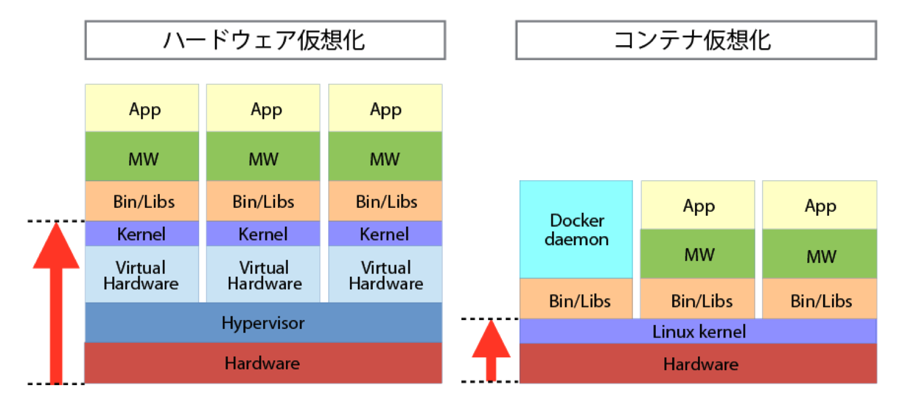

# Docker

##　仕組み

## イメージを作成する

- CentOSイメージを検索  
`# docker search centos`
- CentOSイメージをpull(ダウンロード)  
`# docker pull centos`
- イメージを確認  
`# docker images`

## コンテナ起動

defaultという名前でcentosイメージをコンテナ起動する  
`# docker run -i -t -d --name="default" centos /bin/bash`

## コンテナ確認

起動中のコンテナを確認  
`# docker ps `

    CONTAINER ID  IMAGE          COMMAND    CREATED        STATUS            PORTS  NAMES
    55082e783e5f  centos:latest  /bin/bash  2 seconds ago  Up 1 seconds         default

## コンテナに接続

`#docker attach <コンテナID>/<コンテナ名>`  
-  例  
`#docker attach default`

## コンテナをコミット(イメージ作成)

`# docker commit <コンテナID>/<コンテナ名>  <イメージ名(命名)>`  
-  例  
`# docker commit default httpd`

同一のリポジトリに、タグで管理する場合↓  
`# docker commit <コンテナ名/ID> <イメージ名>:<タグ名> `  
-  例  
`# docker commit default centos:httpd`

## コンテナの削除

`# docker rm <コンテナID>/<コンテナ名>`

## イメージの削除

`# docker rmi <イメージ名>`

## 参考文献

http://qiita.com/gom/items/0bfc1925a7fddfcdfdaf
 
http://qiita.com/mattuso/items/712575dc50513dfdf0a2  

http://codezine.jp/article/detail/7894

